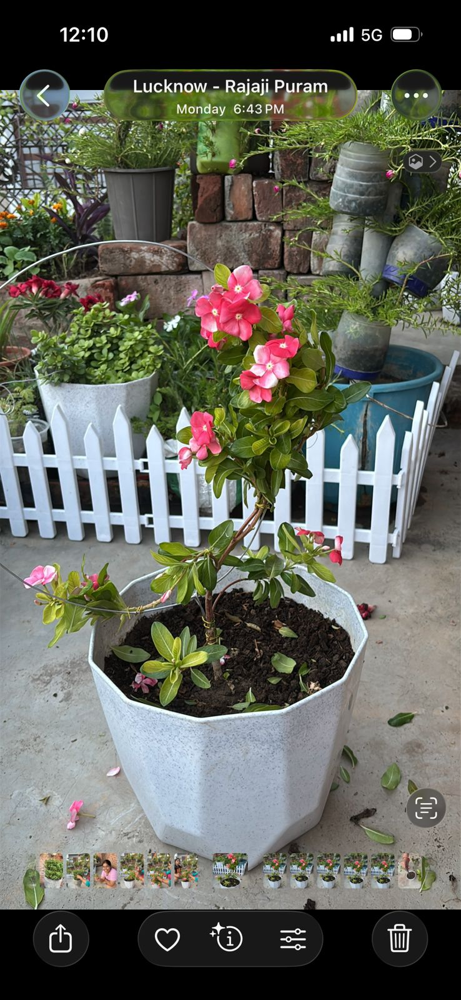

# 🌿 jadenjoy.garden — Website Guide

**Instagram:** [@jadenjoy.garden](https://instagram.com/jadenjoy.garden)
**Location:** Kanpur, India

---

## 📁 Folder Structure

```
jadenjoy-garden/
│
├── index.html                  ← Main website (edit this for content)
│
├── images/
│   ├── gallery/                ← Home page garden photos
│   │   ├── garden1.jpg
│   │   ├── garden2.jpg
│   │   ├── tomatoes.jpg
│   │   ├── sabzi.jpg
│   │   └── seedlings.jpg
│   │
│   ├── products/               ← Product photos (Amazon/Meesho finds)
│   │   ├── compost-powder.jpg
│   │   ├── neem-khali.jpg
│   │   ├── bamboo-basket.jpg
│   │   ├── container.jpg
│   │   ├── seedling-tray.jpg
│   │   └── drip-spikes.jpg
│   │
│   ├── recipes/                ← Khaad recipe photos
│   │   ├── kitchen-waste.jpg
│   │   ├── banana-peel.jpg
│   │   ├── onion-peel.jpg
│   │   └── chai-patti.jpg
│   │
│   ├── blog/                   ← Blog post cover images
│   │   ├── blog1.jpg
│   │   ├── blog2.jpg
│   │   ├── blog3.jpg
│   │   ├── blog4.jpg
│   │   ├── blog5.jpg
│   │   └── blog6.jpg
│   │
│   └── about/                  ← Your personal photos
│       ├── about1.jpg
│       ├── about2.jpg
│       ├── about3.jpg
│       └── about4.jpg
│
└── README.md                   ← This file
```

---

## 🖼️ HOW TO ADD YOUR PHOTOS

### Step 1 — Put photos in the right folder
- Garden photos → `images/gallery/`
- Product photos → `images/products/`
- Recipe photos → `images/recipes/`
- Blog covers → `images/blog/`
- Your personal photos → `images/about/`

### Step 2 — Resize photos before uploading
Use free website: **squoosh.app**
- Resize to max 1200px wide
- Keep file size under 500KB
- Save as .jpg format

### Step 3 — Edit index.html to show the photo

**For Gallery photos** — Find this in index.html:
```html
<div class="gal-ph"><div class="gal-icon">🌿</div>...
```
Replace it with:
```html

```

**For Product photos** — Find this:
```html
<span style="font-size:2.6rem">🪴</span>
```
Replace it with:
```html

```

**For About photos** — Find this:
```html
<div class="about-img-box">🌿</div>
```
Replace it with:
```html
<div class="about-img-box"></div>
```

---

## ✏️ HOW TO UPDATE TEXT

Open `index.html` in **Notepad** (Windows) or **TextEdit** (Mac).

### Change product name:
Find: `Compost Accelerator Powder 1kg`
Replace with your product name

### Change product price:
Find: `₹299 <s>₹450</s>`
Replace with your price

### Change Amazon/Meesho link:
Find: `window.open('https://amazon.in','_blank')`
Replace with your actual product link

### Change WhatsApp number:
Find: `https://wa.me/91XXXXXXXXXX`
Replace with: `https://wa.me/91YOURNUMBER`

---

## 🚀 HOW TO DEPLOY ON GITHUB (FREE)

### Step 1 — Create GitHub Account
Go to **github.com** → Sign Up (free)

### Step 2 — Create Repository
- Click **+** → New repository
- Name: `jadenjoy-garden`
- Set to **Public**
- Click **Create repository**

### Step 3 — Upload Your Files
- Click **Add file** → **Upload files**
- Drag and drop the ENTIRE `jadenjoy-garden` folder
- Click **Commit changes**

### Step 4 — Enable GitHub Pages
- Go to **Settings** tab
- Click **Pages** (left sidebar)
- Source → **Deploy from a branch**
- Branch → **main** → **/ (root)**
- Click **Save**

### Step 5 — Your Website is LIVE! 🎉
Your URL will be:
`https://YOUR-GITHUB-USERNAME.github.io/jadenjoy-garden`

---

## 🔄 HOW TO UPDATE WEBSITE LATER

1. Edit `index.html` or add new photos to folders
2. Go to your GitHub repository
3. Click **Add file** → **Upload files**
4. Upload changed files
5. Click **Commit changes**
6. Website updates in 1-2 minutes ✅

---

## 💡 TIPS

- **VS Code** (free app from code.visualstudio.com) is the best way to edit index.html — it shows colors and helps avoid mistakes
- Always test your website locally (just double-click index.html to open in browser) before uploading to GitHub
- Keep original photos backed up on your phone/computer
- Compress photos before uploading — smaller files = faster website

---

## 📞 Need Help?
Instagram: [@jadenjoy.garden](https://instagram.com/jadenjoy.garden)
